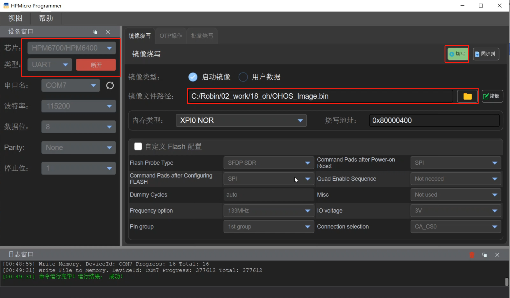
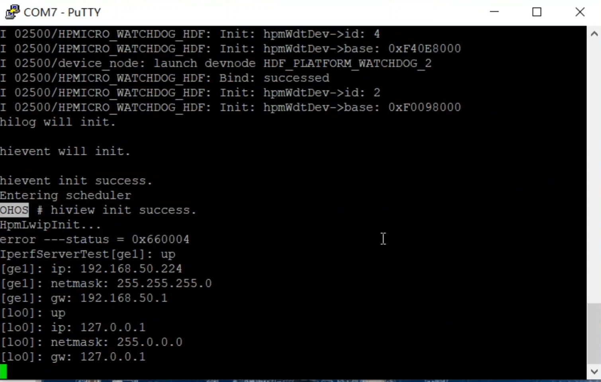

# HPMicro 鸿蒙开发环境搭建

采用Windows加Linux虚拟机的方式开发。

## 安装虚拟机和Ubuntu

### 安装虚拟机

虚拟机采用VirtualBox, 可以在以下链接中下载：

https://www.virtualbox.org/wiki/Downloads

### Ubuntu安装

#### 版本要求及下载链接

**Ubuntu需要 20.04及以上版本**, 对于已经安装好虚拟机的用户，可以通过以下命令查看版本：

```shell
lsb_release -a
```

注意：上述命令在ubuntu的terminal中运行，下同。

比如，我的虚拟机中的ubuntu是22.04.2 LTS版本，使用上述命令后显示如下信息：

```shell
robin@ubuntu2204:~$ lsb_release -a
No LSB modules are available.
Distributor ID:	Ubuntu
Description:	Ubuntu 22.04.2 LTS
Release:	22.04
Codename:	jammy
```

如果版本不符合要求，或者没有安装虚拟机，需要在下述连接中下载iso安装镜像。

https://cn.ubuntu.com/download/desktop

#### 安装注意事项

虚拟机安装请参考网络资料，或者参考我录制的视频(上传B站)：

[从零开始搭建先楫HPM6750的鸿蒙开发环境](https://www.bilibili.com/video/BV1ic411k7g4)


需要注意的几点是:

1. 虚拟硬盘要大于80G，因为加上代码和系统，硬盘占用已经到60多G了。
2. 内存和CPU可以适当开大一点。

## Ubuntu的配置

为了方便在window和虚拟机中进行交叉编译，建议开启虚拟机增强功能，并使能以下功能：

* 共享粘贴板（双向）：用于复制命令等
* 共享文件夹：用于拿出编译好的bin文件等
* 双向拖拽（可选）

上述配置可参考网络资料，或者参考我录制的视频：
[从零开始搭建先楫HPM6750的鸿蒙开发环境](https://www.bilibili.com/video/BV1ic411k7g4)

### 配置共享文件夹

本文需要说明的是，配置共享文件夹时，需要将用户加到vboxsf这个组里，使用的命令如下：

```shell
sudo usermod -aG vboxsf yourname
```
注意：上述命令中的`yourname`请替换为你的ubuntu用户名

添加好分组后，查看命令如下：

```shell
groups yourname
```

特别提醒：**配置完上述内容后，需要重启虚拟机才能生效**。

### 配置python

开发要求的python版本是3.8及以上版本。建议安装3.9。 3.10也可以，需要改一个地方，见后文。

现在新版本的ubuntu都是自带了python的。

以我安装的Ubuntu 22.04.2 LTS为例，默认python版本为：3.10。python版本查看方式：

```shell
python --version
```

如果上述命令执行出错，请尝试：

```shell
python3 --version
```

如果只有python3能获得版本, 需要使用以下命令来建一个默认python的链接：

查看python3的路径：

```shell
which python3.10
```

上述命令将输出python3.10的路径，如：`/usr/bin/python3.10`

```shell
sudo update-alternatives --install /usr/bin/python python /usr/bin/python3.10 1 
```

如果没安装python, 安装3.9的相关命令如下:

```shell
sudo apt-get update
sudo apt-get install python3.9 python3-pip 
```

### 安装必要的工具

执行如下命令，安装一些必要的工具。

```shell
sudo apt-get install git git-lfs vim curl
```

注意：**因为我习惯使用vim进行编辑，本文中内容也使用vim进行修改，如果不习惯vim进行编辑，可以使用gedit， 使用时将我使用命令中的vim替换为gedit即可**。

## 配置repo和gitee

需要从gitee上拉取鸿蒙代码。且鸿蒙代码通过repo管理。

### 注册gitee账号

需要注册gitee账号，如果已有账号，请跳过。

网站链接：https://gitee.com/

注册好账号后，需要把邮箱也设置好。

### SSH公钥配置

在ubuntu的Termial中，通过以下命令生成SSH公钥：

```shell
ssh-keygen -t ed25519 -C "Gitee SSH Key"
```

上述参考中：

* -t 指定类型为ed25519
* -c 注释内容

生成的公钥放在了`home/yourname`下面。可通过以下命令查看：

```shell
cat ~/.ssh/id_ed25519.pub
```

输出的公钥内容如：

```
ssh-ed25519 ABC123***6B Gitee SSH Key
```
将上述输出内容复制，打开gitee网页，通过主页右上角 **「个人设置」->「安全设置」->「SSH 公钥」->「[添加公钥](https://gitee.com/profile/sshkeys)」** ，添加生成的 public key 添加到当前账户中。

注意：添加公钥时，需要输入gitee网站的密码。

安装好后，可以通过下述命令进行测试：

```shell
ssh -T git@gitee.com
```
如显示类似如下内容，刚表示配置成功：
```
Hi yourname(@xxx)! You've successfully authenticated, but GITEE.COM does not provide shell access.
```

### git配置

如果没有下载git (前述章节已经提出) , 可以采用如下命令下载安装：

```shell
sudo apt-get install git git-lfs
```

安装好后，配置git信息：

```shell
git config --global user.name "yourname"
git config --global user.email "your-email-address"
git config --global credential.helper store
```

注意：上述配置中，`yourname` 是你在gitee上的昵称，`your-email-address`是你在gitee上配置的邮箱。

### 安装和配置repo

在home目录下创建一个bin文件夹：

```shell
mkdir ~/bin
```

下载repo

```shell
curl https://gitee.com/oschina/repo/raw/fork_flow/repo-py3 -o ~/bin/repo 
```

给repo增加可执行权限：

```shell
chmod a+x ~/bin/repo
```

安装必要的python库：

```shell
pip3 install -i https://repo.huaweicloud.com/repository/pypi/simple requests
```

添加环境变量，通过vim或者gedit编辑`~/.bashrc`

```shell
vim ~/.bashrc
```

在打开的文件中，最后添加如下行：

```shell
export PATH=~/bin:$PATH
```

保存退出后，执行如下命令，使修改生效：

```shell
source ~/.bashrc
```


### 拉取代码

新建一个目录，用于存放鸿蒙代码，如新建一个01_ohos的文件夹：

```shell
mkdir 01_ohos
```

之后进入目录：

```
cd 01_ohos
```

**目前可以用的分支是4.0的release分支，后续还有哪些分支可用，请联系HPMicro工程师确认**。

先进行repo初始化，执行如下命令：

```shell
repo init -u git@gitee.com:openharmony/manifest.git -b OpenHarmony-4.0-Release --no-repo-verify
```

使用下述命令同步代码，根据电脑配置和网速，需要几十分钟到几小时不等：

```shell
repo sync -c
```

下载git中的大文件，此过程也需要几十分钟：

```shell
repo forall -c 'git lfs pull'
```

上述步骤中如果报错，尝试重新拉取。

### prebuild下载

在上述下载好的鸿蒙代码根目录下，如我使用的`01_ohos`下，执行以下命令，安装必要的工具：

```shell
bash build/prebuilts_download.sh
```

注意：执行上述命令时，可能会因为网络等问题，有失败或者错误的情况，出错后多尝试几次。

## 配置工具链

### 安装riscv32 gcc编译工具

首先，需要下载和配置RSIC-V的编译工具，用以下命令切换到`home/yourname`目录：

```shell
cd ~
```

执行以下命令，下载工具链:

```shell
wget https://repo.huaweicloud.com/harmonyos/compiler/gcc_riscv32/7.3.0/linux/gcc_riscv32-linux-7.3.0.tar.gz
```

下载好后，使用如下命令解压到当前目录下：

```
tar -xvf gcc_riscv32-linux-7.3.0.tar.gz -C ~
```

解压完成后，会有一个名叫`gcc-riscv32`的文件夹，其中包含了gcc的工具链。

之后进行环境变量配置，同样的，使用vim或者gedit, 编辑`~/.bashrc`

```shell
vim ~/.bashrc
```

在打开的文件中，最后添加如下行：

```shell
export PATH=~/gcc_riscv32/bin:$PATH
```

保存退出后，执行如下命令，使修改生效：

```shell
source ~/.bashrc
```

### 安装鸿蒙build工具hb

切换到前述下载的鸿蒙代码根目录下，执行如下命令安装hb：

```shell
python -m pip install --user build/hb
```

安装好后，同样地，需要添加环境变量

```shell
vim ~/.bashrc
export PATH=~/.local/bin:$PATH
source ~/.bashrc
```

备注：如果后续不需要hb了，删除hb命令如下：

```shell
pip3 uninstall ohos-build
```

安装好后，可以通过以下命令检查hb是否安装成功：

```
hb help
```

正常情况下会打印出帮助信息。

如果使用的python版本是3.10时，可能会遇到`cannot import name 'Mapping' from 'collections'`的错误。

需要用vim或者gedit修改报错的python文件：

```shell
vim ~/.local/lib/python3.10/site-packages/prompt_toolkit/styles/from_dict.py
```

将代码中报错的地方，从

```python
from collections import Mapping
```

改为

```python
from collections.abc import Mapping
```


## 编译代码

切换到前述下载的鸿蒙代码根目录下，执行如下命令进行编译设置：

```shell
hb set
```

用上下键选择`mini`后回车，之后选择到hpmicro->hpm6740evk2后回车。

 

 

之后执行如下命令进行编译：

```shell
hb build -f
```

编译成功后，bin文件位于根目录下如下位置：

```shell
out/hpm6750evk2/hpm6750evk2/OHOS_Image.bin
```


## 下载测试

### 取出生成的bin文件

通过前述配置的共享文件夹，或者直接采用配置好的拖拽的方式，将OHOS_Image.bin文件拿出到windows环境下：

```shell
cp out/hpm6750evk2/hpm6750evk2/OHOS_Image.bin ~/yourSharedDir
```

### 用HPMicro_Manufacturing_Tool下载bin文件

将HPM6750EVK2的拨码开关配置为ISP下载模式。

通过USB0或者UART0，用HPMicro_Manufacturing_Tool将bin文件下载到HPM6750EVK2中：



### 代码测试

将拨码开关配置为00，重新上电或者按reset重启，可以在串口中进行鸿蒙命令行：




## 遇到的问题及解决思路

### 磁盘空间问题

如果你已有的虚拟机硬盘太小，下载代码出现空间不够的情况，可以先在虚拟机设置中加大空间，之后再通过gparted在虚拟机中配置，具体用法请自行搜索网络。

```shell
sudo apt-get install gparted
sudo gparted 
```

这时可能还会遇到read-only改不了的问题，remount一下可以解决。

### 安装hb出错

1. 安装hb，需要在下载好的鸿蒙代码根目录下进行。
2. 使用的命令是：`python -m pip install --user build/hb`而不是`pip install --user ./build/lite`

如果使用如下命令：

```shell
pip install --user ./build/lite
```

会报错：

```
ERROR: Directory './build/lite' is not installable. Neither 'setup.py' nor 'pyproject.toml' found.
```

正确的命令是：

```shell
python -m pip install --user build/hb
```

### `hb set`找不到Mapping的问题

在使用python3.10时，执行`hb set`使用命令，会有以下错误：

```
cannot import name 'Mapping' from 'collections'
```

这是因为在python3.10版本后，requests库有进行调整，collections中不能直接调用Mapping。应改为如下：

```python
from collections.abc import Mapping
```

